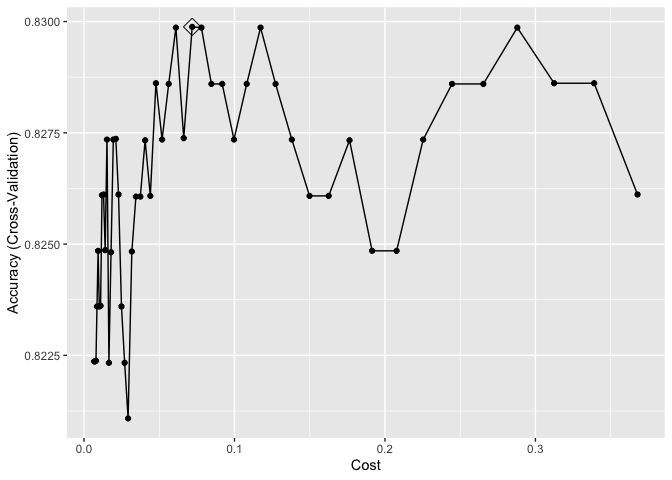
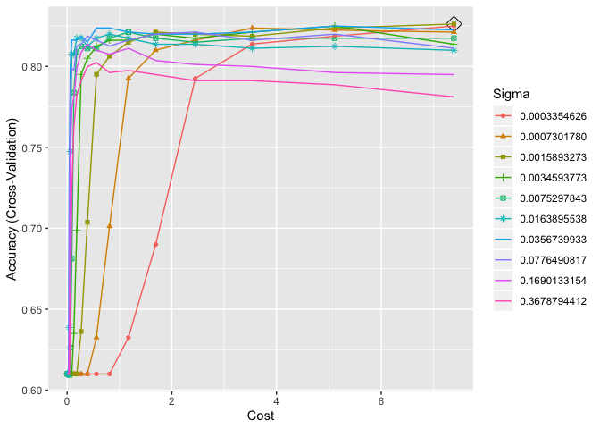

P8106\_hw5\_xh2395
================
Xin He
5/9/2020

## Homework 5 Description

This problem involves the OJ data set which is part of the ISLR package.
The data contains 1070 purchases where the customer either purchased
Citrus Hill or Minute Maid Orange Juice. A number of characteristics of
the customer and product are recorded. Create a training set containing
a random sample of 800 observations, and a test set containing the
remaining observations.

## Import the data

``` r
data(OJ)
oj_data = OJ %>% 
  janitor::clean_names()
```

## Create training data and test data

``` r
set.seed(2020)
rowTrain = createDataPartition(y = oj_data$purchase,
                               p = 799/1070,
                               list = F)
train_data = oj_data[rowTrain, ]
test_data = oj_data[-rowTrain, ]
```

## a) Fit a support vector classifier (linear kernel)

``` r
ctrl = trainControl(method = "cv")

set.seed(2020)

svml_fit = train(purchase ~ ., 
                  data = train_data, 
                  method = "svmLinear2",
                  preProcess = c("center", "scale"),
                  tuneGrid = data.frame(cost = exp(seq(-5,-1,len=50))),
                  trControl = ctrl)
```

### output

``` r
svml_fit$finalModel
```

    ## 
    ## Call:
    ## svm.default(x = as.matrix(x), y = y, kernel = "linear", cost = param$cost, 
    ##     probability = classProbs)
    ## 
    ## 
    ## Parameters:
    ##    SVM-Type:  C-classification 
    ##  SVM-Kernel:  linear 
    ##        cost:  0.07188749 
    ## 
    ## Number of Support Vectors:  359

``` r
svml_fit$bestTune
```

    ##          cost
    ## 30 0.07188749

### plot

``` r
ggplot(svml_fit, highlight = TRUE)
```

<!-- -->

### training error rate

``` r
pred_train = predict(svml_fit)
mean(train_data$purchase != pred_train)
```

    ## [1] 0.1625

The training error rate is 16.25%.

### test error rate

``` r
pred_test = predict(svml_fit, newdata = test_data, type = "raw")
mean(test_data$purchase != pred_test)
```

    ## [1] 0.1592593

The test error rate is 15.93%.

## b) Fit a support vector machine with a radial kernel

``` r
svmr_grid = expand.grid(C = exp(seq(-5,2,len=20)),
                         sigma = exp(seq(-8,-1,len=10)))

set.seed(2020) 

svmr_fit = train(purchase ~ ., train_data,
                  method = "svmRadial",
                  preProcess = c("center", "scale"),
                  tuneGrid = svmr_grid,
                  trControl = ctrl)
```

### output

``` r
svmr_fit$finalModel
```

    ## Support Vector Machine object of class "ksvm" 
    ## 
    ## SV type: C-svc  (classification) 
    ##  parameter : cost C = 7.38905609893065 
    ## 
    ## Gaussian Radial Basis kernel function. 
    ##  Hyperparameter : sigma =  0.00158932728345653 
    ## 
    ## Number of Support Vectors : 394 
    ## 
    ## Objective Function Value : -2655.774 
    ## Training error : 0.16875

``` r
svmr_fit$bestTune
```

    ##           sigma        C
    ## 193 0.001589327 7.389056

### plot

``` r
ggplot(svmr_fit, highlight = TRUE)
```

    ## Warning: The shape palette can deal with a maximum of 6 discrete values
    ## because more than 6 becomes difficult to discriminate; you have
    ## 10. Consider specifying shapes manually if you must have them.

    ## Warning: Removed 80 rows containing missing values (geom_point).

<!-- -->

### training error rate

``` r
pred_train2 = predict(svmr_fit)
mean(train_data$purchase != pred_train2)
```

    ## [1] 0.16875

The training error rate is 16.88%.

### test error rate

``` r
pred_test2 = predict(svmr_fit, newdata = test_data, type = "raw")
mean(test_data$purchase != pred_test2)
```

    ## [1] 0.162963

The test error rate is 16.30%.
